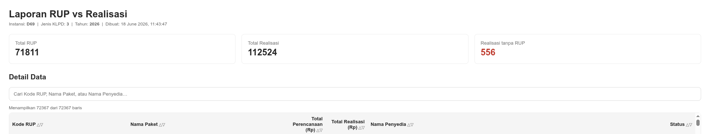

# inaproc-report

Mengunduh data RUP dan Realisasi pengadaan dari [data.inaproc.id](https://data.inaproc.id) lalu menggabungkannya menjadi laporan HTML interaktif.

## Fitur

- Download otomatis CSV RUP dan Realisasi via Playwright
- Merge keduanya berdasarkan Kode RUP
- Deteksi anomali: realisasi yang tidak memiliki pasangan RUP
- Output laporan HTML dengan fitur search dan sort per kolom
- Mendukung mode headless (tanpa tampilan browser)

## Instalasi

```bash
# 1. Clone repo
git clone https://github.com/username/inaproc-report.git
cd inaproc-report

# 2. Buat virtual environment (opsional tapi disarankan)
python -m venv .venv
source .venv/bin/activate      # Linux/Mac
.venv\Scripts\activate         # Windows

# 3. Install dependencies
pip install -r requirements.txt

# 4. Install browser Chromium
playwright install chromium
```

## Konfigurasi

Buka `main.py` dan ubah bagian ini:

```python
TAHUN      = "2026"   # tahun anggaran
JENIS_KLPD = "4"      # lihat tabel di bawah
INSTANSI   = "D270"   # kode instansi, contoh: D69 = Prov. DKI Jakarta
HEADLESS   = True     # True = tanpa tampilan browser (direkomendasikan)
MAX_RETRY  = 10
```

### Kode Jenis KLPD

| Kode | Jenis |
|------|-------|
| 1 | Kementerian |
| 2 | Lembaga |
| 3 | Provinsi |
| 4 | Kabupaten |
| 5 | Kota |
| 6 | BUMN |

### Kode Instansi

Kode instansi bisa dilihat dari URL saat membuka halaman RUP di [data.inaproc.id](https://data.inaproc.id), contohnya:

| Kode | Instansi | Jenis |
|------|----------|-------|
| D69 | Prov. DKI Jakarta | Provinsi |
| D115 | Kab. Bekasi | Kabupaten |
| D114 | Kota Bekasi | Kota |

## Penggunaan

### Cara 1 — Edit konstanta langsung (paling simpel)

Ubah nilai di blok konfigurasi, lalu:

```bash
python main.py
```

### Cara 2 — Argumen CLI

```bash
python main.py --tahun 2025 --instansi D69 --jenis-klpd 3
```

### Semua opsi CLI

| Argumen | Nilai | Keterangan |
|---------|-------|------------|
| `--tahun` | angka tahun | Tahun anggaran |
| `--jenis-klpd` | 1–6 | Jenis KLPD |
| `--instansi` | kode instansi | Kode instansi target |
| `--headless` | `true` / `false` | Mode headless |
| `--max-retry` | angka | Maksimal percobaan download |

## Output

File HTML disimpan di direktori yang sama dengan script:

```
rup_vs_realisasi_D270_2026_20260617_104530.html
```

Contoh screenshot hasil laporan:

<p align="center">
  
</p>

Buka file HTML tersebut di browser. Baris merah menandakan realisasi yang tidak memiliki pasangan RUP.

## Kolom Laporan

- **Kode RUP**: Kode unik paket pengadaan pada sistem RUP.
- **Nama Paket**: Nama paket pekerjaan/peberian layanan sebagaimana tercantum di RUP.
- **Total Perencanaan (Rp)**: Nilai anggaran yang direncanakan pada RUP (dalam Rupiah).
- **Total Realisasi (Rp)**: Jumlah realisasi pembayaran atau kontrak yang tercatat (dalam Rupiah).
- **Nama Penyedia**: Nama penyedia yang tercatat pada data realisasi (jika ada).
- **Status**: Menampilkan salah satu dari:
	- `Realisasi tanpa RUP` — artinya ada data realisasi yang tidak ditemukan pasangan RUP.
	- persentase realisasi terhadap perencanaan seperti `85.23%` untuk baris yang memiliki RUP.

## Catatan Data & Penggunaan

- Data yang diambil oleh script ini berasal dari layanan publik yang disediakan oleh LKPP (melalui data.inaproc.id).
- Script ini disediakan untuk keperluan edukasi, pembelajaran, dan uji analisis saja. Penggunaan script atau data untuk kegiatan yang melanggar hukum, manipulasi, atau tindakan yang merugikan pihak lain tidak dibenarkan.
- Pengguna bertanggung jawab memastikan kepatuhan terhadap ketentuan penggunaan data dan peraturan yang berlaku sebelum memakai data hasil download untuk tujuan lain.

- Jika download gagal berulang kali coba set `HEADLESS = False` untuk melihat langsung apa yang terjadi di browser.
- Mode headless menggunakan chromium args anti-deteksi bawaan Playwright, tidak memerlukan library tambahan.